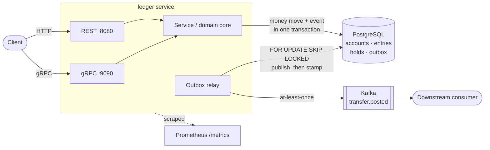

# ledger

[](https://github.com/mkmbhs/ledger/actions/workflows/ci.yml)

A small, correct **wallet / payments ledger** in Go. It does the two things that
make moving money hard — **transactional correctness** and **safe retries** —
and it models the real payment lifecycle with **authorization holds**
(`authorize → capture / void / expire`), not just instant transfers.

It is intentionally not a framework. It is a clear, tested core that shows how to
move money without ever creating it, destroying it, double-applying a request, or
spending funds that are already reserved.

```
make race     # go test -race ./...   the idempotency, concurrency + hold proofs
make run      # go run ./cmd/ledger   a tiny demo
```

## The problem

Every wallet, payments, or settlement system has to answer the same questions:

- If a client retries after a timeout, does the money move twice?
- If two operations touch one account at once, can a balance be lost?
- When you *authorize* a payment (or place a bet, or pre-auth a card), how do you
  fence off the funds so they can't be spent twice before the capture lands?
- Does every movement balance, so the books always reconcile?

This repo answers those with the smallest amount of code that makes the answers
obvious and testable.

## Core concepts

**Double-entry.** Every transfer posts two `entries` — a debit and a credit that
sum to zero. Money is never created or destroyed; the books always balance.

**Integer money.** Amounts are `int64` minor units (e.g. cents). Never a float.

**Available vs. settled balance.** An account has a settled `Balance` and a `Held`
amount reserved by active holds. **`Available = Balance - Held`** is what can
actually be spent. A direct transfer can only spend *available* funds.

**Idempotency keys.** Authorize, capture, and transfer all carry an idempotency
key. The first request applies; any retry with the same key returns the original
result without applying it again. This is what makes the system safe to retry.

## Authorization holds (the payment lifecycle)

A hold reserves funds before deciding to move them — the primitive behind card
auth-then-capture, wallet reserve-then-settle, and placing then settling a wager.

```
Authorize ──> hold ACTIVE (funds reserved, Available drops, nothing moved)
                │
                ├─ Capture(amount ≤ held) ─> money moves; remainder released ─> CAPTURED
                ├─ Void                    ─> all funds released, nothing moved ─> VOIDED
                └─ (deadline passes)       ─> ExpireHolds releases the funds   ─> EXPIRED
```

- **Capture** can be partial: capturing 100 of a 300 hold moves 100 and returns
  the other 200 to available.
- **Void** is idempotent (voiding twice never double-releases).
- **Expiry** is deterministic (the clock is injectable) so stale reservations
  don't fence off funds forever.

## Atomicity lives in the Store

Business validation (positive amount, distinct accounts, key required) lives in
the `Service`; atomic, idempotent application lives behind the `Store` interface.

- `MemStore` — an in-memory reference implementation. A single mutex makes every
  operation serializable, so it is the simplest possible *specification* of
  correctness, and the concurrency tests run against it.
- PostgreSQL (the `postgres` package, schema in
  [`migrations/0001_init.sql`](migrations/0001_init.sql)) — a `UNIQUE` constraint
  on the idempotency key plus `SELECT ... FOR UPDATE` (in a deadlock-safe, sorted
  lock order) inside one transaction give the same guarantees at scale, and a
  deferred constraint trigger
  ([`migrations/0003_entries_must_balance.sql`](migrations/0003_entries_must_balance.sql))
  makes the database itself refuse a commit whose entries don't balance.

Both stores pass **the same conformance suite**, exported as the
[`ledgertest`](ledgertest/) package (20 scenarios: idempotent replay under
concurrency, conservation, the hold lifecycle, invariant checks after every
scenario). The MemStore run needs nothing but `go test ./...`; the PostgreSQL
run is the same suite against a real database via testcontainers
(`go test -tags=integration ./...`). Any other `ledger.Store` implementation
can import `ledgertest` and make the same claim — see
[`ledgertest/README.md`](ledgertest/README.md).

## What the tests prove

Run with the race detector (`make race`):

- **Idempotency under retries** — 200 concurrent retries of one key apply a
  transfer exactly once.
- **No lost updates / no double-spend** — 500 concurrent transfers conserve the
  total balance exactly.
- **Property-based fuzzing** — `FuzzTransfers` asserts three invariants on
  every randomized transfer sequence: money is conserved, each balance equals
  opening + its entries, and all entries net to zero. The seed corpus runs on
  every `go test`; `go test -fuzz FuzzTransfers` explores millions of inputs.
- **The hold lifecycle** — reserve-without-moving, full and partial capture,
  void (and idempotent double-void), expiry, and that a direct transfer can never
  spend held funds.
- Validation across the board: insufficient funds, currency mismatch, unknown
  account, over-capture, capture-after-void, expired-hold, and idempotency
  conflicts.
- **Unbalanced writes are refused, twice** — every path that writes entries
  enforces the zero-sum check in code, and a deferred constraint trigger makes
  PostgreSQL itself refuse any commit whose entries don't sum to zero. The
  integration suite proves it with direct SQL that bypasses the application.
- **Account creation is idempotent** — re-creating an account identically is a
  no-op; a mismatched re-create is refused, so an existing balance is never
  silently reset.
- **Both stores pass one spec** — the [`ledgertest`](ledgertest/) conformance
  suite runs untagged against the in-memory reference and, behind the
  `integration` tag, against real PostgreSQL. The suite is importable, so the
  claim "passes conformance v1" is one any store implementation can earn — or
  fail.

~90% statement coverage; `go vet` and `gofmt` clean.

## Architecture

REST and gRPC are thin transports over one domain `Service`. A money move and its
event are written in the **same database transaction** (the outbox), so they can
never disagree. A separate relay drains the outbox to Kafka at-least-once, using
`FOR UPDATE SKIP LOCKED` so it stays correct even if it is split into its own
worker for horizontal scale.



## Running the full stack

```
docker compose up --build
```

brings up the service plus Postgres, Kafka (redpanda), Prometheus, and Grafana.
The app waits for its dependencies to be healthy, applies migrations, and serves
REST on `:8080` and gRPC on `:9090`.

```bash
# REST
curl -XPOST localhost:8080/v1/accounts  -d '{"id":"alice","currency":"USD","opening":1000}'
curl -XPOST localhost:8080/v1/accounts  -d '{"id":"bob","currency":"USD","opening":0}'
curl -XPOST localhost:8080/v1/transfers -d '{"idempotency_key":"k1","from_account_id":"alice","to_account_id":"bob","amount":250}'
curl localhost:8080/v1/accounts/alice            # balance now 750
curl localhost:8080/metrics                        # Prometheus metrics

# gRPC (reflection is enabled)
grpcurl -plaintext -d '{"id":"alice"}' localhost:9090 ledger.v1.LedgerService/GetAccount

# the transfer.posted event lands on Kafka:
docker compose exec redpanda rpk topic consume ledger.transfers --num 1

# watch events with the example consumer (joins the compose network):
docker compose --profile tools up consumer

# drive concurrent load and check the money-conservation invariant:
go run ./cmd/loadtest -accounts 50 -workers 32 -duration 10s
```

Prometheus is at `:9091`, Grafana (anonymous) at `:3000`.

## Layout

```
./                      package ledger: domain + the in-memory reference Store, and all the proofs
ledgertest/             the store-agnostic conformance suite — import it to test your own Store
postgres/               PostgreSQL Store (pgx, FOR UPDATE) + transactional outbox writes + integration tests
internal/outbox/        the Kafka relay (FOR UPDATE SKIP LOCKED, at-least-once)
internal/transport/rest/    REST API over the Service
internal/transport/grpcsvc/ gRPC API (proto-generated) over the Service
internal/metrics/       Prometheus instrumentation (HTTP middleware + gRPC interceptor)
proto/ledger/v1/        the gRPC contract
migrations/             PostgreSQL schema (embedded; applied on startup)
cmd/server/             the service: REST + gRPC + metrics + outbox relay, graceful shutdown
cmd/consumer/           an example Kafka consumer that prints transfer.posted events
cmd/loadtest/           a concurrent load generator that also asserts money is conserved
cmd/ledger/             a tiny library demo
Dockerfile · docker-compose.yml · deploy/   the runnable stack
```

Integration tests are behind a build tag, so the default `go test ./...` needs no
database; run them with `go test -tags=integration ./...` (requires Docker).

## Limitations

Scope decisions, stated as such:

- **One currency per transfer.** Both accounts must carry the same currency;
  there is no FX inside the ledger. Converting money is a business workflow
  (two transfers and a rate), not a storage primitive.
- **Transfers are two-legged.** Every transfer is one debit and one matching
  credit. Fee splits and multi-party settlements are modeled as multiple
  transfers.
- **No authentication or multi-tenancy.** The REST and gRPC APIs are reference
  transports for the domain service; put them behind your own gateway.
- **The Kafka consumer is reference-grade.** It shows at-least-once consumption
  with dedupe on the event id; it is not a consumer framework.

## Prior art & positioning

Why not just use an existing system? Depending on what you need, do:

- [TigerBeetle](https://github.com/tigerbeetle/tigerbeetle) enforces these same
  invariants — double-entry, idempotent transfers, two-phase holds — inside a
  purpose-built distributed database, and adds a level of testing rigor
  (deterministic simulation across a replicated cluster) no application-layer
  ledger matches. It is the right call when you need extreme throughput and are
  ready to operate a replicated Zig cluster with its own client protocol. It is
  not something you read to learn how a ledger works.
- [Formance](https://github.com/formancehq/ledger),
  [Blnk](https://github.com/blnkfinance/blnk), and
  [Midaz](https://github.com/LerianStudio/midaz) ship these invariants as
  products: platforms with consoles, SDKs, and multi-leg postings (Formance
  and Midaz each with a posting DSL).
- [pgledger](https://github.com/pgr0ss/pgledger) is the closest relative — a
  readable, pure-PostgreSQL ledger that makes the opposite bet: all logic lives
  in PL/pgSQL functions with a single implementation (and no idempotency keys
  or holds). Worth reading side by side with this repo for the
  where-should-invariants-live argument.

This repo exists for the remaining job: **the patterns, readable in one
sitting, inside the PostgreSQL you already run** — with the correctness claims
expressed as tests you can execute (and a [conformance suite](ledgertest/) you
can point at your own store) rather than as documentation you have to trust.

## Roadmap

- [x] **M1** — double-entry core, idempotent transfers, concurrency- and fuzz-proven.
- [x] **Holds** — authorize / capture / void / expire, with available-balance semantics.
- [x] **M2** — PostgreSQL `Store` (`FOR UPDATE` + unique idempotency key) + testcontainers integration tests.
- [x] **M3** — transactional outbox publishing `transfer.posted` events to Kafka (at-least-once relay).
- [x] **M4** — REST + gRPC APIs, Prometheus metrics, Docker Compose (distroless image).

## License

MIT — see [LICENSE](LICENSE).
